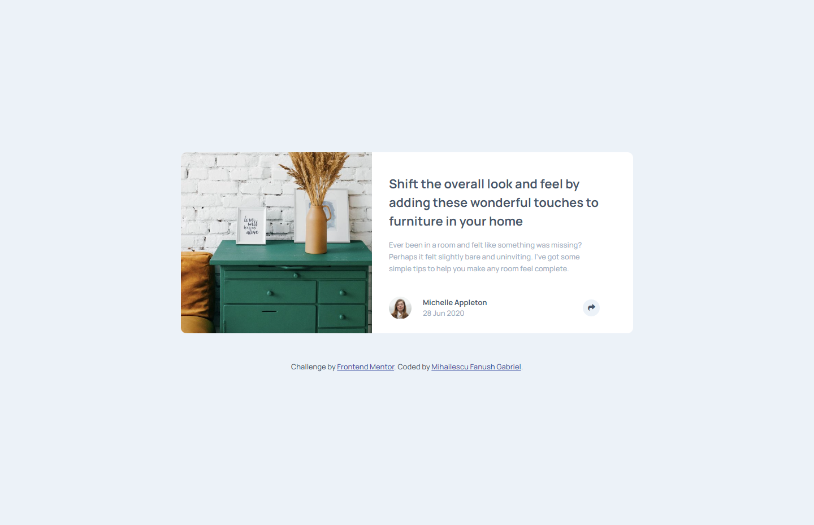
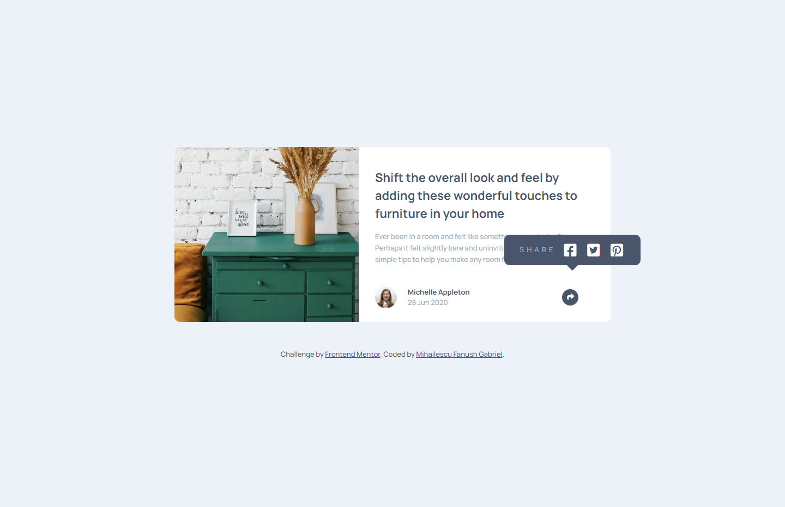
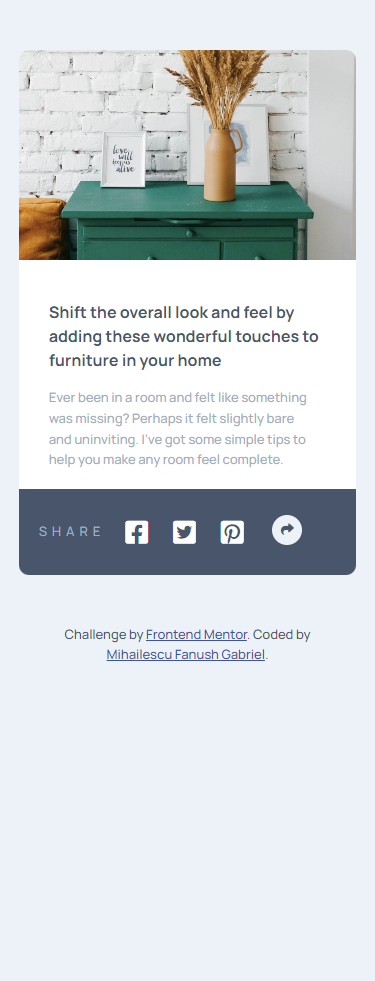
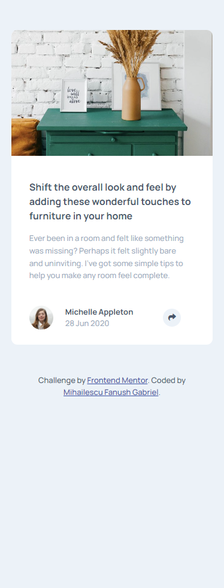

# Frontend Mentor - Article preview component solution

This is a solution to the [Article preview component challenge on Frontend Mentor](https://www.frontendmentor.io/challenges/article-preview-component-dYBN_pYFT). Frontend Mentor challenges help you improve your coding skills by building realistic projects. 

## Table of contents

- [Overview](#overview)
  - [The challenge](#the-challenge)
  - [Screenshot](#screenshot)
  - [Links](#links)
- [My process](#my-process)
  - [Built with](#built-with)
  - [What I learned](#what-i-learned)
  - [Continued development](#continued-development)
  - [Useful resources](#useful-resources)
- [Author](#author)
- [Acknowledgments](#acknowledgments)

## Overview

### The challenge

Users should be able to:

- View the optimal layout for the component depending on their device's screen size
- See the social media share links when they click the share icon

### Screenshot

### Links

- Solution URL: [Add solution URL here](https://github.com/Fanushhh/article-preview-component-master)
- Live Site URL: [Add live site URL here](https://fanushhh.github.io/article-preview-component-master/)

## My process

### Built with

- Semantic HTML5 markup
- CSS custom properties
- Flexbox

### What I learned

With this challenge I am glad I've got to practice more with absolute and relative positioning as they are always taboo subjects that I'm trying to avoid mostly because it was hard to wrap my head around them at first, but it gets easier.

## Author

- Website - [My Website](https://fanushhh.github.io/Stylized-Website/)
- Frontend Mentor - [@Fanushhh](https://www.frontendmentor.io/profile/Fanushhh)

